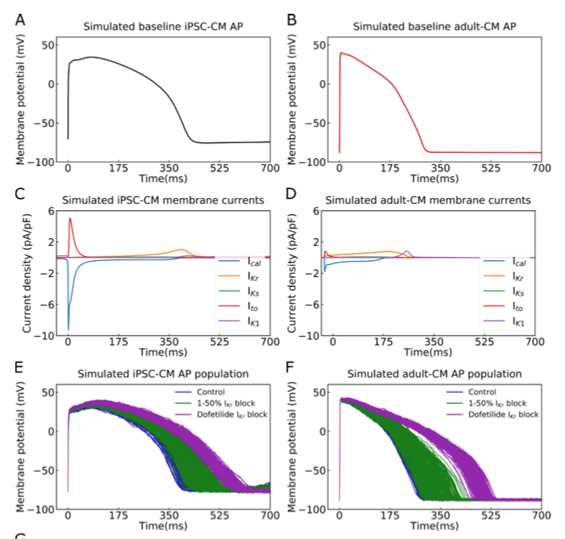
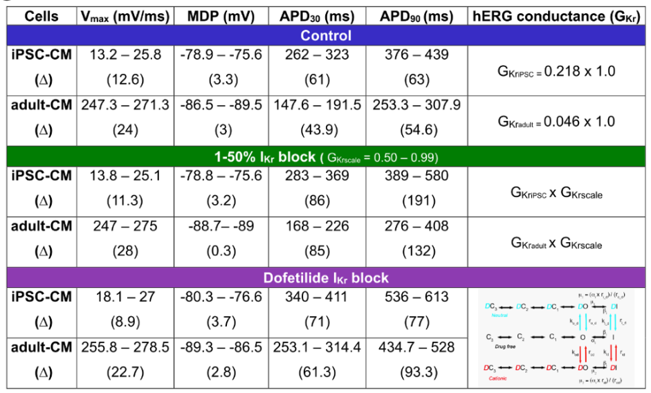
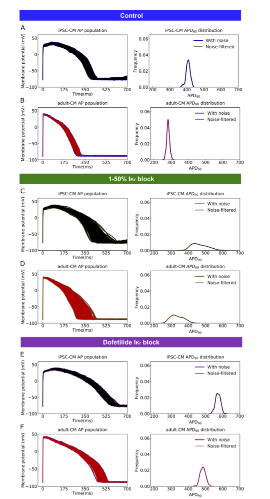

```{r setup, include=FALSE}
knitr::opts_chunk$set(
	echo = TRUE,
	warning = TRUE,
	message = TRUE,
	comment = "##",
	prompt = FALSE,
	tidy = TRUE,
	tidy.opts = list(blank = FALSE, width.cutoff = 75),
	fig.path = "img/",
	fig.align = "center"
)
```

# Introduction
Goal of Paper: My data replication project will be on the paper "A deep learning algorithm to translate and classify cardiac electrophysiology: From induced pluripotent stem cell-derived cardiomyocytes to adult cardiac cells". This paper details the development of a machine learning algorithm to classify samples as different types of heart cells based on their electrophysiology. In recent years, the advancement of human induced pluripotent stem cells (hiPSCs), and their ability to be differentiated into functional cardiomyocytes, has revolutionized how me may study drug effects on the heart. hiPSC derived cardiomyocytes (hiPSC-CM) can theoretically be effective in vitro models, able to model complex drug responses on a patient-specify level. On large challenge, however, is the large functionality gap that exist between hiPSC-CM and the adult cardiac tissue they are supposed to model. We see significant differences in iPSC-CM metabolism, calcium signaling, and contractility.  The goal of this paper was to classify the action potentials of hiPSC-CMs into drug-free or drugged categories and transform these waveforms into adult CM action potential waveforms. 

Data used: Raw cardiac action potentials were developed using in silico models of CMs, specifically the Kernik in silico iPSC-CMs and O’Hara-Rudy in silico human adult-CMs. Drugged and drug-free conditions were created by incorporating ion channel blockers into waveform generation models. 2 blocking methods were modeled: a synthetic 1-50% Ikr channel block and a block using Dofetilide, a potent clinical Ikr channel blocker. 

Analysis conducted: Synthetic waveforms were generated and summary statistics on waveform upstroke velocity, maximum diastolic potential, and action potential duration. Waveform noise was then cleaned using digital forward and backward filtering techniques. A multi-task network was trained and then tested on iPSC drugged and drug free waveforms. Another multitask network was then used to transform iPSC waveforms into adult waveforms. 
Conclusions: The multitask network performed well in classifying drugged vs non drugged iPSC-CMs as characterized by area under the receiver operator curve, accuracy, precision and recall. Low mean squared error values and high correlation coefficient values indicate the network transform iPSC-CM waveforms into adult CM waveforms well.  

Proposed Replication: As the multitask network is outside my expertise, I will be replicating the analysis in this paper up until the implementation of the multitask network (Figure 1 and Figure 2). This includes the reading in, characterization, and noise filtering of generated iPSC-CM and Adult-CM. Through this replication, I will load in .csv files that describe the waveforms of control and ion channel blocked waveforms. I will then generate summary statistics that describe upstroke velocity (Vmax), maximum diastolic potential (MDP) and action potential duration (APD) of each condition and cell type (Figure 1). I will then load in provided noise filtered data, preform the described analysis of frequency of ADP90, and run a statistical analysis comparing noisy and de-noised waveforms (Figure 2). 


```{r}
library(tidyverse)
library(reshape2)
library(ggpubr)
library(mosaic)
library(cowplot)
```
# Replications
```{r}
#Reading in data
adultControl = read_csv("clean_data/adult_control_with_noise.csv", col_names=FALSE)
adultFBlock = read_csv("clean_data/adult_block_with_noise.csv", col_names = FALSE)
adultDBlock = read_csv("clean_data/adult_dof_with_noise.csv", col_names = FALSE)
ipscControl = read_csv("clean_data/ipsc_control_with_noise.csv", col_names = FALSE)
ipscFBlock = read_csv("clean_data/ipsc_block_with_noise.csv", col_names = FALSE)
ipscDBlock = read_csv("clean_data/ipsc_dof_with_noise.csv", col_names = FALSE)

head(adultControl) # 
print('loaded in data has Membrane potential in rows and columns represent at different observations  at different time points. In this orientation, each AP waveform is a row.')
```
## Figure 1 
```{r}
# Calculating Control Average Traces for Figure 1
ipscMeanControl = colMeans(ipscControl) # averaging across all observations to generate mean membrane potential at each time point
adultMeanControl = colMeans(adultControl)
time = 0:700 # establishing time vector
meanControls = as_tibble(cbind(time, ipscMeanControl, adultMeanControl)) # creating tibble of values to allow for easy recall

# creating plots of  Simulated Adult CM APs with impedance
adultControl = as_tibble(t(adultControl)) #reorganizing data into tidy - so that columns represent unique waveforms
adultFBlock = as_tibble(t(adultFBlock))
adultDBlock = as_tibble(t(adultDBlock))
adultControl$time = 0:700 # establishing vectors of time points
adultFBlock$time = 0:700
adultDBlock$time = 0:700
df =  melt(adultControl ,  id.vars = 'time', variable.name = 'series') #melting inot long format tibbles
df2 = melt(adultFBlock, id.vars = 'time', variable.name = 'series')
df3 = melt(adultDBlock, id.vars = 'time', variable.name = 'series')
adult = ggplot(df, aes(x=time,y = value)) + geom_line(aes(color = 'blue')) + geom_line(data = df2, aes(x = time, y=value,color = 'green')) + geom_line(data = df3, aes(x = time, y=value,color = 'purple')) + xlab("Time(ms)")+ ylab("Membrane Potential (mV)") + scale_colour_manual(name = '', values =c('blue'='blue','green'='green','purple'='purple'), labels = c('Control','1-50% Ikr Block', 'Dofetilide Ikr Block')) + ggtitle("Simulated Adult-CM AP Population")

## creating plots of Simulated ipsc CM APs with impedance (similar workflow to ipscs)
ipscControl = as_tibble(t(ipscControl))
ipscFBlock = as_tibble(t(ipscFBlock))
ipscDBlock = as_tibble(t(ipscDBlock))
ipscControl$time = 0:700
ipscFBlock$time = 0:700
ipscDBlock$time = 0:700
df_i =  melt(ipscControl ,  id.vars = 'time', variable.name = 'series')
df2_i = melt(ipscFBlock, id.vars = 'time', variable.name = 'series')
df3_i = melt(ipscDBlock, id.vars = 'time', variable.name = 'series')
ipsc = ggplot(df_i, aes(x=time,y = value)) + geom_line(aes(color = 'blue')) + geom_line(data = df2_i, aes(x = time, y=value,color = 'green')) + geom_line(data = df3_i, aes(x = time, y=value,color = 'purple')) + xlab("Time(ms)")+ ylab("Membrane Potential (mV)") + scale_colour_manual(name = '', values =c('blue'='blue','green'='green','purple'='purple'), labels = c('Control','1-50% Ikr Block', 'Dofetilide Ikr Block'))+ ggtitle("Simulated  iPSC-CM AP Population")


# Creating mean AP Wavefomr plots
A = ggplot(meanControls, aes(x = time, y = ipscMeanControl)) + geom_line() + ggtitle("Simulated Baseline iPSC-CM AP") + xlab("Time (ms)") + ylab("Membrane Potential (mV)")
B = ggplot(meanControls, aes(x = time, y = adultMeanControl)) + geom_line(color = "red") + ggtitle("Simulated Baseline Adult-CM AP") + xlab("Time (ms)") + ylab("Membrane Potential (mV)")
C = ggplot()
D = ggplot()
E = ipsc
H = adult
plot_grid(A,B,C,D,E,H, labels = "AUTO",ncol = 2) # combining all plots together into one figure 
```

```{r echo=FALSE, out.width="200%"}
 
```

## Figure 1G
```{r}
#removing added time vectors to facilitate efficient processing 
adultControl$time = NULL
adultFBlock$time = NULL
adultDBlock$time = NULL
ipscControl$time = NULL
ipscFBlock$time = NULL
ipscDBlock$time = NULL

# Calculating Depolarization Velocities
# As no equation is provided, velocity is taken to be the derivative of waveforms as velocity is the derivative of displacement 
maxAdultControl = round(sapply(adultControl, diff),digits = 2)
maxAdultFBlock = round(sapply(adultFBlock, diff), digits = 2)
maxAdultDBlock = round(sapply(adultDBlock, diff),digits = 2)

maxipscControl = round(sapply(ipscControl, diff),digits = 2)
maxipscFBlock = round(sapply(ipscFBlock, diff),digits = 2)
maxipscDBlock = round(sapply(ipscDBlock, diff),digits = 2)


# Max Diastolic Potential
# This is simply the minimum membrane potential value of each waveform 
minAdultControl = round(sapply(adultControl, min),digits = 2)
minAdultFBlock = round(sapply(adultFBlock, min),digits = 2)
minAdultDBlock = round(sapply(adultDBlock, min),digits = 2)

minipscControl = round(sapply(ipscControl, min),digits = 2)
minipscFBlock = round(sapply(ipscFBlock, min),digits = 2)
minipscDBlock = round(sapply(ipscDBlock, min),digits = 2)

# Functions to cacluate Action Potential Duration at 30$ repolarization and 90% repolarization
# each work by finding the value in membrane potential that represent 30% and 90% repolarization and then finding the time point at which membrane potential drops below this value.
APD30 = function(df) {
  A = numeric() 
  for (i in 1:ncol(df)){
    vect = df[,i]
    vectnorm = vect+abs(min(vect))
    max = max(vectnorm)
    max30 = .7*max
    A[i] = sum(vectnorm>max30)
   }
  return(A)
}

APD90 = function(df) {
  A = numeric() 
  for (i in 1:ncol(df)){
    vect = df[,i]
    vectnorm = vect+abs(min(vect))
    max = max(vectnorm)
    max90 = .1*max
    A[i] = sum(vectnorm>max90)
   }
  return(A)
}
# Calculating Action potential duration
adultControlAPD30 = APD30(adultControl)
adultFBlockAPD30 = APD30(adultFBlock)
adultDBlockAPD30 = APD30(adultFBlock)

ipscControlAPD30 = APD30(ipscControl)
ipscFBlockAPD30 = APD30(ipscFBlock)
ipscDBlockAPD30 = APD30(ipscFBlock)


adultControlAPD90 = APD90(adultControl)
adultFBlockAPD90 = APD90(adultFBlock)
adultDBlockAPD90 = APD90(adultFBlock)

ipscControlAPD90 = APD90(ipscControl)
ipscFBlockAPD90 = APD90(ipscFBlock)
ipscDBlockAPD90 = APD90(ipscFBlock)

# ORganizing value into table simialr to Figure 1-G
col_names = c("Vmax (mV/ms)","MDP (mV)","ADP30 (ms)","ADP90 (ms)")

iControl = c(paste0(min(maxipscControl),'-',max(maxipscControl)),paste0(min(minipscControl),'-',max(minipscControl)),paste0(min(ipscControlAPD30),'-',max(ipscControlAPD30)),paste0(min(ipscControlAPD90),'-',max(ipscControlAPD90)))
iControlDelta = abs(c(max(maxipscControl)-min(maxipscControl),max(minipscControl)-min(minipscControl),max(ipscControlAPD30)-min(ipscControlAPD30),max(ipscControlAPD90)-min(ipscControlAPD90)))

iFBlock = c(paste0(min(maxipscFBlock),'-',max(maxipscFBlock)),paste0(min(minipscFBlock),'-',max(minipscFBlock)),paste0(min(ipscFBlockAPD30),'-',max(ipscFBlockAPD30)),paste0(min(ipscFBlockAPD90),'-',max(ipscFBlockAPD90)))
iFBlockDelta = abs(c(max(maxipscFBlock)-min(maxipscFBlock),max(minipscFBlock)-min(minipscFBlock),max(ipscFBlockAPD30)-min(ipscFBlockAPD30),max(ipscFBlockAPD90)-min(ipscFBlockAPD90)))

iDBlock = c(paste0(min(maxipscDBlock),'-',max(maxipscDBlock)),paste0(min(minipscDBlock),'-',max(minipscDBlock)),paste0(min(ipscDBlockAPD30),'-',max(ipscDBlockAPD30)),paste0(min(ipscDBlockAPD90),'-',max(ipscDBlockAPD90)))
iDBlockDelta = abs(c(max(maxipscDBlock)-min(maxipscDBlock),max(minipscDBlock)-min(minipscDBlock),max(ipscDBlockAPD30)-min(ipscDBlockAPD30),max(ipscDBlockAPD90)-min(ipscDBlockAPD90)))

aControl = c(paste0(min(maxAdultControl),'-',max(maxAdultControl)),paste0(min(minAdultControl),'-',max(minAdultControl)),paste0(min(adultControlAPD30),'-',max(adultControlAPD30)),paste0(min(adultControlAPD90),'-',max(adultControlAPD90)))
aControlDelta = abs(c(max(maxAdultControl)-min(maxAdultControl),max(minAdultControl)-min(minAdultControl),max(adultControlAPD30)-min(adultControlAPD30),max(adultControlAPD90)-min(adultControlAPD90)))

aFBlock = c(paste0(min(maxAdultFBlock),'-',max(maxAdultFBlock)),paste0(min(minAdultFBlock),'-',max(minAdultFBlock)),paste0(min(adultFBlockAPD30),'-',max(adultFBlockAPD30)),paste0(min(adultFBlockAPD90),'-',max(adultFBlockAPD90)))
aFBlockDelta = abs(c(max(maxAdultFBlock)-min(maxAdultFBlock),max(minAdultFBlock)-min(minAdultFBlock),max(adultFBlockAPD30)-min(adultFBlockAPD30),max(adultFBlockAPD90)-min(adultFBlockAPD90)))

aDBlock = c(paste0(min(maxAdultDBlock),'-',max(maxAdultDBlock)),paste0(min(minAdultDBlock),'-',max(minAdultDBlock)),paste0(min(adultDBlockAPD30),'-',max(adultDBlockAPD30)),paste0(min(adultDBlockAPD90),'-',max(adultDBlockAPD90)))
aDBlockDelta = abs(c(max(maxAdultDBlock)-min(maxAdultDBlock),max(minAdultDBlock)-min(minAdultDBlock),max(adultDBlockAPD30)-min(adultDBlockAPD30),max(adultDBlockAPD90)-min(adultDBlockAPD90)))


G = rbind(iControl,round(iControlDelta,digits = 1),
          aControl,round(aControlDelta,digits = 1),
          iFBlock,round(iFBlockDelta,digits = 1),
          aFBlock,round(aFBlockDelta,digits = 1),
          iDBlock,round(iDBlockDelta,digits = 1),
          aDBlock,round(aDBlockDelta,digits = 1))

colnames(G) = col_names
rownames(G) = c("IPSC-CM","Delta","adult-CM","Delta","IPSC-CM","Delta","adult-CM","Delta","IPSC-CM","Delta","adult-CM","Delta")
G
```

```{r echo=FALSE, out.width="200%"}

```

## Figure 2
```{r}
#Loading in filtered data from files
adultControl_Ns = as_tibble(t(read_csv("clean_data/adult_control_without_noise.csv", col_names=FALSE)))
adultFBlock_Ns = as_tibble(t(read_csv("clean_data/adult_block_without_noise.csv", col_names = FALSE)))
adultDBlock_Ns = as_tibble(t(read_csv("clean_data/adult_dof_without_noise.csv", col_names = FALSE)))
ipscControl_Ns = as_tibble(t(read_csv("clean_data/ipsc_control_without_noise.csv", col_names = FALSE)))
ipscFBlock_Ns = as_tibble(t(read_csv("clean_data/ipsc_block_without_noise.csv", col_names = FALSE)))
ipscDBlock_Ns = as_tibble(t(read_csv("clean_data/ipsc_dof_without_noise.csv", col_names = FALSE)))

# calculating ADP90 of filtered data sets
aCnsAPD90 = APD90(adultControl_Ns)
aFBns90 = APD90(adultFBlock_Ns)
aDBns90 = APD90(adultDBlock_Ns)
iCnsAPD90 = APD90(ipscControl_Ns)
iFBns90 = APD90(ipscFBlock_Ns)
iDBns90 = APD90(ipscDBlock_Ns)

# Creating Plots of Noise and Filtered AP Waveforms
adultControl_Ns$time = 0:700
adultFBlock_Ns$time = 0:700
adultDBlock_Ns$time = 0:700
ipscControl_Ns$time = 0:700
ipscFBlock_Ns$time = 0:700
ipscDBlock_Ns$time = 0:700

df_ins = melt(ipscControl_Ns,  id.vars = 'time', variable.name = 'series') # melting data into long format for plotting
ipscControl_plot = ggplot(df_i, aes(x=time,y = value)) + geom_line(aes(color = 'blue'))+geom_line(data = df_ins, aes(x = time, y=value,color = 'black')) + xlab("Time(ms)")+ ylab("Membrane Potential (mV)") + scale_colour_manual(name = '', values =c('blue'='blue','black'='black'), labels = c('With Noise','Noise Filtered'))+ggtitle("Simulated iPSC-CM AP Population")

df2_ins = melt(ipscFBlock_Ns, id.vars = 'time', variable.name = 'series')
ipscFBlock_plot = ggplot(df2_i, aes(x=time,y = value)) + geom_line(aes(color = 'green'))+geom_line(data = df2_ins, aes(x = time, y=value,color = 'black')) + xlab("Time(ms)")+ ylab("Membrane Potential (mV)") + scale_colour_manual(name = '', values =c('green'='green','black'='black'), labels = c('With Noise','Noise Filtered'))+ggtitle("Simulated iPSC-CM AP Population")

df3_ins = melt(ipscDBlock_Ns, id.vars = 'time', variable.name = 'series')
ipscDBlock_plot = ggplot(df3_i, aes(x=time,y = value)) + geom_line(aes(color = 'purple'))+geom_line(data = df3_ins, aes(x = time, y=value,color = 'black')) + xlab("Time(ms)")+ ylab("Membrane Potential (mV)") + scale_colour_manual(name = '', values =c('purple'='purple','black'='black'), labels = c('With Noise','Noise Filtered'))+ggtitle("Simulated iPSC-CM AP Population")

df_ns = melt(adultControl_Ns,  id.vars = 'time', variable.name = 'series')
adultControl_plot = ggplot(df, aes(x=time,y = value)) + geom_line(aes(color = 'blue'))+geom_line(data = df_ns, aes(x = time, y=value,color = 'red')) + xlab("Time(ms)")+ ylab("Membrane Potential (mV)") + scale_colour_manual(name = '', values =c('blue'='blue','red'='red'), labels = c('With Noise','Noise Filtered'))+ggtitle("Simulated Adult-CM AP Population")

df2_ns = melt(adultFBlock_Ns, id.vars = 'time', variable.name = 'series')
adultFBlock_plot = ggplot(df2_i, aes(x=time,y = value)) + geom_line(aes(color = 'green'))+geom_line(data = df2_ins, aes(x = time, y=value,color = 'red')) + xlab("Time(ms)")+ ylab("Membrane Potential (mV)") + scale_colour_manual(name = '', values =c('green'='green','red'='red'), labels = c('With Noise','Noise Filtered'))+ggtitle("Simulated Adult-CM AP Population")

df3_ns = melt(adultDBlock_Ns, id.vars = 'time', variable.name = 'series')
adultDBlock_plot = ggplot(df3_i, aes(x=time,y = value)) + geom_line(aes(color = 'purple'))+geom_line(data = df3_ins, aes(x = time, y=value,color = 'red')) + xlab("Time(ms)")+ ylab("Membrane Potential (mV)") + scale_colour_manual(name = '', values =c('purple'='purple','red'='red'), labels = c('With Noise','Noise Filtered'))+ggtitle("Simulated Adult-CM AP Population")


#Creating Histogram Plots
adultcontrol_APD90_plot = ggplot(data = as_tibble(aCnsAPD90), aes(x = value))+geom_density(aes( y=..count../sum(..count..)*10),color = "red")+geom_density(data = as_tibble(adultControlAPD90),aes(x = value, y=..count../sum(..count..)*10),color = "blue") +  xlab("APD90")+ ylab("Frequency") + scale_colour_manual(name = '', values =c('blue'='blue','red'='red'), labels = c('With Noise','Noise Filtered'))+ggtitle("Adult-CM APD90 Distribution")

ipsccontrol_APD90_plot = ggplot(data = as_tibble(iCnsAPD90), aes(x = value))+geom_density(aes( y=..count../sum(..count..)*10),color = "black")+geom_density(data = as_tibble(ipscControlAPD90),aes(x = value, y=..count../sum(..count..)*10),color = "blue") +  xlab("APD90")+ ylab("Frequency") + scale_colour_manual(name = '', values =c('blue'='blue','black'='black'), labels = c('With Noise','Noise Filtered'))+ggtitle("iPSC-CM APD90 Distribution")

adultFB_APD90_plot = ggplot(data = as_tibble(aFBns90), aes(x = value))+geom_density(aes( y=..count../sum(..count..)*10),color = "red")+geom_density(data = as_tibble(adultFBlockAPD90),aes(x = value, y=..count../sum(..count..)*10),color = "green") +  xlab("APD90")+ ylab("Frequency") + scale_colour_manual(name = '', values =c('green'='green','red'='red'), labels = c('With Noise','Noise Filtered'))+ggtitle("Adult-CM APD90 Distribution")

ipscFB_APD90_plot = ggplot(data = as_tibble(iFBns90), aes(x = value))+geom_density(aes( y=..count../sum(..count..)*10),color = "black")+geom_density(data = as_tibble(ipscFBlockAPD90),aes(x = value, y=..count../sum(..count..)*10),color = "green") +  xlab("APD90")+ ylab("Frequency") + scale_colour_manual(name = '', values =c('green'='green','black'='black'), labels = c('With Noise','Noise Filtered'))+ggtitle("iPSC-CM APD90 Distribution")

adultDB_APD90_plot = ggplot(data = as_tibble(aDBns90), aes(x = value))+geom_density(aes( y=..count../sum(..count..)*10),color = "red")+geom_density(data = as_tibble(adultDBlockAPD90),aes(x = value, y=..count../sum(..count..)*10),color = "purple") +  xlab("APD90")+ ylab("Frequency") + scale_colour_manual(name = '', values =c('purple'='purple','red'='red'), labels = c('With Noise','Noise Filtered'))+ggtitle("Adult-CM APD90 Distribution")

ipscDB_APD90_plot = ggplot(data = as_tibble(iDBns90), aes(x = value))+geom_density(aes( y=..count../sum(..count..)*10),color = "black")+geom_density(data = as_tibble(ipscDBlockAPD90),aes(x = value, y=..count../sum(..count..)*10),color = "purple") +  xlab("APD90")+ ylab("Frequency") + scale_colour_manual(name = '', values =c('purple'='purple','black'='black'), labels = c('With Noise','Noise Filtered'))+ggtitle("iPSC-CM APD90 Distribution")


#plotting Population waveforms and APD90 histograms
plot_grid(ipscControl_plot, ipsccontrol_APD90_plot,
          adultControl_plot, adultcontrol_APD90_plot,
          ncol = 2)
plot_grid(ipscFBlock_plot, ipscFB_APD90_plot,
          adultFBlock_plot,adultFB_APD90_plot, ncol=2)
plot_grid(ipscDBlock_plot, ipscDB_APD90_plot,
          adultDBlock_plot, adultDB_APD90_plot,ncol = 2)
```

```{r echo=FALSE, out.width="200%"}

```

## Inferential Statistics of Noise vs. Filtered APD90
```{r}
# T-tests comparing noisey and filtered ADP90s
Acont = t.test(x = aCnsAPD90,y =adultControlAPD90  , mu = 0, alternative = "two.sided")$p.value
Afb = t.test(x = aFBns90,y =adultFBlockAPD90  , mu = 0, alternative = "two.sided")$p.value
Adb = t.test(x = aDBns90,y =adultDBlockAPD90  , mu = 0, alternative = "two.sided")$p.value
icont = t.test(x = iCnsAPD90,y =ipscControlAPD90  , mu = 0, alternative = "two.sided")$p.value
ifb = t.test(x = iFBns90,y =ipscFBlockAPD90  , mu = 0, alternative = "two.sided")$p.value
idb = t.test(x = iDBns90,y =ipscDBlockAPD90  , mu = 0, alternative = "two.sided")$p.value

#assembling pvalues into table 
pvals = cbind(c(icont,ifb,idb),c(Acont,Afb,Adb))
pvals = round(pvals,digits = 2)
colnames(pvals) = c("IPSC","Adult")
rownames(pvals) = c("Control","1-50% Ikr Block","Dofetilide Ikr Block")
pvals
```

# Discussion and Reflection

On the whole, I was able to truly replicate only very little of what I proposed. Loading and massaging the data into workable formats were successful. Plotting average and population waveforms (Figure 1A,B,E,F) was successful. Simulated membrane currents graphs were unable to be plotted as ion current data was not included in published dataset. I believe these values were derived directly from the in-silico models used to create these waveforms. Regarding summary statistics on the waveform characteristics, ranges and delta were able to be found for each data condition.  The outcomes of this analysis, however, differ from the results stated in the paper for almost all parameters. This can be attributed to the lack of methodology provided for conducting this analysis. Homemade functions were built to find each of these characteristics, reflecting what I could find in the literature about these parameters. But as I did not have access to the formula for each of these characteristics, I wasn’t able to replicate exactly the analysis conducted in the paper. Specifically on depolarization velocities, I believe that their velocities were derived using a different time vector as there is mention of a cycle length of 982ms in the caption of figure 1, but that is not shown in any of the plots. This caused me some confusion, but I eventually decided to go with a time vector of 0-700 so as to match the plots. These inaccuracies propagated into the attempted replication of analysis preformed in figure 2 of the paper. Though I am able to generate similar Waveform plots, the line histograms of Action Potential Duration 90% (APD90)  values differ from what is published. This difference can again be attributed to the homemade function used to calculate APD90. Additionally, I added two tailed t-test analysis, this was not done in the paper. This statistical analysis shows that in 2/3 conditions, filtering does not change APD90. The significant change in APD90 in Dofetilide conditions can be attributed to the homemade APD90 function, influencing calculated ADP90 values.


