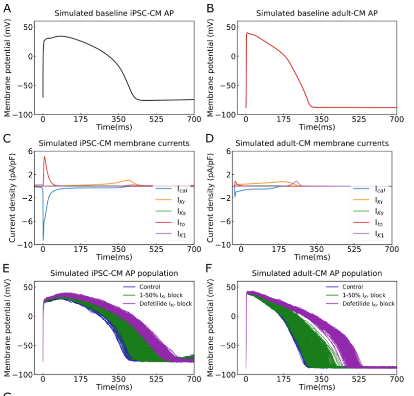

```{r setup, include=FALSE}
knitr::opts_chunk$set(
	echo = TRUE,
	warning = TRUE,
	message = TRUE,
	comment = "##",
	prompt = FALSE,
	tidy = TRUE,
	tidy.opts = list(blank = FALSE, width.cutoff = 75),
	fig.path = "img/",
	fig.align = "center"
)
```

# Introduction


```{r}
library(tidyverse)
library(cowplot)
library(reshape2)
library(ggpubr)
library(mosaic)
```
# Replications
```{r}
#Reading in data
adultControl = read_csv("clean_data/adult_control_with_noise.csv", col_names=FALSE)
adultFBlock = read_csv("clean_data/adult_block_with_noise.csv", col_names = FALSE)
adultDBlock = read_csv("clean_data/adult_dof_with_noise.csv", col_names = FALSE)
ipscControl = read_csv("clean_data/ipsc_control_with_noise.csv", col_names = FALSE)
ipscFBlock = read_csv("clean_data/ipsc_block_with_noise.csv", col_names = FALSE)
ipscDBlock = read_csv("clean_data/ipsc_dof_with_noise.csv", col_names = FALSE)

head(adultControl)

# Calculating Control Average Traces for Figure 1
ipscMeanControl = colMeans(ipscControl)
adultMeanControl = colMeans(adultControl)
meanControls = as_tibble(cbind(time, ipscMeanControl, adultMeanControl))

## creating plots of  Simulated Adult CM APs with impedance
adultControl = as_tibble(t(adultControl))
adultFBlock = as_tibble(t(adultFBlock))
adultDBlock = as_tibble(t(adultDBlock))
adultControl$time = 0:700
adultFBlock$time = 0:700
adultDBlock$time = 0:700
df =  melt(adultControl ,  id.vars = 'time', variable.name = 'series')
df2 = melt(adultFBlock, id.vars = 'time', variable.name = 'series')
df3 = melt(adultDBlock, id.vars = 'time', variable.name = 'series')
adult = ggplot(df, aes(x=time,y = value)) + geom_line(aes(color = 'blue')) + geom_line(data = df2, aes(x = time, y=value,color = 'green')) + geom_line(data = df3, aes(x = time, y=value,color = 'purple')) + xlab("Time(ms)")+ ylab("Membrane Potential (mV)") + scale_colour_manual(name = '', values =c('blue'='blue','green'='green','purple'='purple'), labels = c('Control','1-50% Ikr Block', 'Dofetilide Ikr Block')) + ggtitle("Simulated Adult-CM AP Population")

## creating plots of Simulated ipsc CM APs with impedance
ipscControl = as_tibble(t(ipscControl))
ipscFBlock = as_tibble(t(ipscFBlock))
ipscDBlock = as_tibble(t(ipscDBlock))
ipscControl$time = 0:700
ipscFBlock$time = 0:700
ipscDBlock$time = 0:700
df_i =  melt(ipscControl ,  id.vars = 'time', variable.name = 'series')
df2_i = melt(ipscFBlock, id.vars = 'time', variable.name = 'series')
df3_i = melt(ipscDBlock, id.vars = 'time', variable.name = 'series')
ipsc = ggplot(df_i, aes(x=time,y = value)) + geom_line(aes(color = 'blue')) + geom_line(data = df2_i, aes(x = time, y=value,color = 'green')) + geom_line(data = df3_i, aes(x = time, y=value,color = 'purple')) + xlab("Time(ms)")+ ylab("Membrane Potential (mV)") + scale_colour_manual(name = '', values =c('blue'='blue','green'='green','purple'='purple'), labels = c('Control','1-50% Ikr Block', 'Dofetilide Ikr Block'))+ ggtitle("Simulated  iPSC-CM AP Population")

```
### Data Visualization
Explain
(Figure 1A-F in paper)
```{r}
A = ggplot(meanControls, aes(x = time, y = ipscMeanControl)) + geom_line() + ggtitle("Simulated Baseline iPSC-CM AP") + xlab("Time (ms)") + ylab("Membrane Potential (mV)")
B = ggplot(meanControls, aes(x = time, y = adultMeanControl)) + geom_line(color = "red") + ggtitle("Simulated Baseline Adult-CM AP") + xlab("Time (ms)") + ylab("Membrane Potential (mV)")
C = ggplot()
D = ggplot()
E = ipsc
H = adult
plot_grid(A, B, C, D, E, H,labels = "AUTO",ncol = 2)
```

```{r echo=FALSE, out.width="200%"}

```

### Descriptive Statistics 
(Figure 1G in paper)
```{r}
adultControl$time = NULL
adultFBlock$time = NULL
adultDBlock$time = NULL
ipscControl$time = NULL
ipscFBlock$time = NULL
ipscDBlock$time = NULL

# Depolarization Velocities
maxAdultControl = round(sapply(adultControl, diff),digits = 2)
maxAdultFBlock = round(sapply(adultFBlock, diff), digits = 2)
maxAdultDBlock = round(sapply(adultDBlock, diff),digits = 2)

maxipscControl = round(sapply(ipscControl, diff),digits = 2)
maxipscFBlock = round(sapply(ipscFBlock, diff),digits = 2)
maxipscDBlock = round(sapply(ipscDBlock, diff),digits = 2)


# Max Diastolic Potential
minAdultControl = round(sapply(adultControl, min),digits = 2)
minAdultFBlock = round(sapply(adultFBlock, min),digits = 2)
minAdultDBlock = round(sapply(adultDBlock, min),digits = 2)

minipscControl = round(sapply(ipscControl, min),digits = 2)
minipscFBlock = round(sapply(ipscFBlock, min),digits = 2)
minipscDBlock = round(sapply(ipscDBlock, min),digits = 2)

APD30 = function(df) {
  A = numeric() 
  for (i in 1:ncol(df)){
    vect = df[,i]
    vectnorm = vect+abs(min(vect))
    max = max(vectnorm)
    max30 = .7*max
    A[i] = sum(vectnorm>max30)
   }
  return(A)
}

APD90 = function(df) {
  A = numeric() 
  for (i in 1:ncol(df)){
    vect = df[,i]
    vectnorm = vect+abs(min(vect))
    max = max(vectnorm)
    max90 = .1*max
    A[i] = sum(vectnorm>max90)
   }
  return(A)
}
#Action potential duration
adultControlAPD30 = APD30(adultControl)
adultFBlockAPD30 = APD30(adultFBlock)
adultDBlockAPD30 = APD30(adultFBlock)

ipscControlAPD30 = APD30(ipscControl)
ipscFBlockAPD30 = APD30(ipscFBlock)
ipscDBlockAPD30 = APD30(ipscFBlock)


adultControlAPD90 = APD90(adultControl)
adultFBlockAPD90 = APD90(adultFBlock)
adultDBlockAPD90 = APD90(adultFBlock)

ipscControlAPD90 = APD90(ipscControl)
ipscFBlockAPD90 = APD90(ipscFBlock)
ipscDBlockAPD90 = APD90(ipscFBlock)

col_names = c("Vmax (mV/ms)","MDP (mV)","ADP30 (ms)","ADP90 (ms)")

iControl = c(paste0(min(maxipscControl),'-',max(maxipscControl)),paste0(min(minipscControl),'-',max(minipscControl)),paste0(min(ipscControlAPD30),'-',max(ipscControlAPD30)),paste0(min(ipscControlAPD90),'-',max(ipscControlAPD90)))
iControlDelta = abs(c(max(maxipscControl)-min(maxipscControl),max(minipscControl)-min(minipscControl),max(ipscControlAPD30)-min(ipscControlAPD30),max(ipscControlAPD90)-min(ipscControlAPD90)))

iFBlock = c(paste0(min(maxipscFBlock),'-',max(maxipscFBlock)),paste0(min(minipscFBlock),'-',max(minipscFBlock)),paste0(min(ipscFBlockAPD30),'-',max(ipscFBlockAPD30)),paste0(min(ipscFBlockAPD90),'-',max(ipscFBlockAPD90)))
iFBlockDelta = abs(c(max(maxipscFBlock)-min(maxipscFBlock),max(minipscFBlock)-min(minipscFBlock),max(ipscFBlockAPD30)-min(ipscFBlockAPD30),max(ipscFBlockAPD90)-min(ipscFBlockAPD90)))

iDBlock = c(paste0(min(maxipscDBlock),'-',max(maxipscDBlock)),paste0(min(minipscDBlock),'-',max(minipscDBlock)),paste0(min(ipscDBlockAPD30),'-',max(ipscDBlockAPD30)),paste0(min(ipscDBlockAPD90),'-',max(ipscDBlockAPD90)))
iDBlockDelta = abs(c(max(maxipscDBlock)-min(maxipscDBlock),max(minipscDBlock)-min(minipscDBlock),max(ipscDBlockAPD30)-min(ipscDBlockAPD30),max(ipscDBlockAPD90)-min(ipscDBlockAPD90)))

aControl = c(paste0(min(maxAdultControl),'-',max(maxAdultControl)),paste0(min(minAdultControl),'-',max(minAdultControl)),paste0(min(adultControlAPD30),'-',max(adultControlAPD30)),paste0(min(adultControlAPD90),'-',max(adultControlAPD90)))
aControlDelta = abs(c(max(maxAdultControl)-min(maxAdultControl),max(minAdultControl)-min(minAdultControl),max(adultControlAPD30)-min(adultControlAPD30),max(adultControlAPD90)-min(adultControlAPD90)))

aFBlock = c(paste0(min(maxAdultFBlock),'-',max(maxAdultFBlock)),paste0(min(minAdultFBlock),'-',max(minAdultFBlock)),paste0(min(adultFBlockAPD30),'-',max(adultFBlockAPD30)),paste0(min(adultFBlockAPD90),'-',max(adultFBlockAPD90)))
aFBlockDelta = abs(c(max(maxAdultFBlock)-min(maxAdultFBlock),max(minAdultFBlock)-min(minAdultFBlock),max(adultFBlockAPD30)-min(adultFBlockAPD30),max(adultFBlockAPD90)-min(adultFBlockAPD90)))

aDBlock = c(paste0(min(maxAdultDBlock),'-',max(maxAdultDBlock)),paste0(min(minAdultDBlock),'-',max(minAdultDBlock)),paste0(min(adultDBlockAPD30),'-',max(adultDBlockAPD30)),paste0(min(adultDBlockAPD90),'-',max(adultDBlockAPD90)))
aDBlockDelta = abs(c(max(maxAdultDBlock)-min(maxAdultDBlock),max(minAdultDBlock)-min(minAdultDBlock),max(adultDBlockAPD30)-min(adultDBlockAPD30),max(adultDBlockAPD90)-min(adultDBlockAPD90)))


G = rbind(iControl,round(iControlDelta,digits = 1),
          aControl,round(aControlDelta,digits = 1),
          iFBlock,round(iFBlockDelta,digits = 1),
          aFBlock,round(aFBlockDelta,digits = 1),
          iDBlock,round(iDBlockDelta,digits = 1),
          aDBlock,round(aDBlockDelta,digits = 1))

colnames(G) = col_names
rownames(G) = c("IPSC-CM","Delta","adult-CM","Delta","IPSC-CM","Delta","adult-CM","Delta","IPSC-CM","Delta","adult-CM","Delta")
G


```

```{r echo=FALSE, out.width="200%"}

```

### Inferential Statistical Analysis
```{r}
adultControl_Ns = as_tibble(t(read_csv("clean_data/adult_control_without_noise.csv", col_names=FALSE)))
adultFBlock_Ns = as_tibble(t(read_csv("clean_data/adult_block_without_noise.csv", col_names = FALSE)))
adultDBlock_Ns = as_tibble(t(read_csv("clean_data/adult_dof_without_noise.csv", col_names = FALSE)))
ipscControl_Ns = as_tibble(t(read_csv("clean_data/ipsc_control_without_noise.csv", col_names = FALSE)))
ipscFBlock_Ns = as_tibble(t(read_csv("clean_data/ipsc_block_without_noise.csv", col_names = FALSE)))
ipscDBlock_Ns = as_tibble(t(read_csv("clean_data/ipsc_dof_without_noise.csv", col_names = FALSE)))


aCnsAPD90 = APD90(adultControl_Ns)
aFBns90 = APD90(adultFBlock_Ns)
aDBns90 = APD90(adultDBlock_Ns)
iCnsAPD90 = APD90(ipscControl_Ns)
iFBns90 = APD90(ipscFBlock_Ns)
iDBns90 = APD90(ipscDBlock_Ns)

Acont = t.test(x = aCnsAPD90,y =adultControlAPD90  , mu = 0, alternative = "two.sided")$p.value
Afb = t.test(x = aFBns90,y =adultFBlockAPD90  , mu = 0, alternative = "two.sided")$p.value
Adb = t.test(x = aDBns90,y =adultDBlockAPD90  , mu = 0, alternative = "two.sided")$p.value
icont = t.test(x = iCnsAPD90,y =ipscControlAPD90  , mu = 0, alternative = "two.sided")$p.value
ifb = t.test(x = iFBns90,y =ipscFBlockAPD90  , mu = 0, alternative = "two.sided")$p.value
idb = t.test(x = iDBns90,y =ipscDBlockAPD90  , mu = 0, alternative = "two.sided")$p.value

pvals = cbind(c(icont,ifb,idb),c(Acont,Afb,Adb))
pvals = round(pvals,digits = 2)
colnames(pvals) = c("IPSC","Adult")
rownames(pvals) = c("Control","1-50% Ikr Block","Dofetilide Ikr Block")

```

```{r}
# Creating Plots of Noise and Filtered AP Waveforms
adultControl_Ns$time = 0:700
adultFBlock_Ns$time = 0:700
adultDBlock_Ns$time = 0:700
ipscControl_Ns$time = 0:700
ipscFBlock_Ns$time = 0:700
ipscDBlock_Ns$time = 0:700

df_ins = melt(ipscControl_Ns,  id.vars = 'time', variable.name = 'series')
ipscControl_plot = ggplot(df_i, aes(x=time,y = value)) + geom_line(aes(color = 'blue'))+geom_line(data = df_ins, aes(x = time, y=value,color = 'black')) + xlab("Time(ms)")+ ylab("Membrane Potential (mV)") + scale_colour_manual(name = '', values =c('blue'='blue','black'='black'), labels = c('With Noise','Noise Filtered'))+ggtitle("Simulated iPSC-CM AP Population")

df2_ins = melt(ipscFBlock_Ns, id.vars = 'time', variable.name = 'series')
ipscFBlock_plot = ggplot(df2_i, aes(x=time,y = value)) + geom_line(aes(color = 'green'))+geom_line(data = df2_ins, aes(x = time, y=value,color = 'black')) + xlab("Time(ms)")+ ylab("Membrane Potential (mV)") + scale_colour_manual(name = '', values =c('green'='green','black'='black'), labels = c('With Noise','Noise Filtered'))+ggtitle("Simulated iPSC-CM AP Population")

df3_ins = melt(ipscDBlock_Ns, id.vars = 'time', variable.name = 'series')
ipscDBlock_plot = ggplot(df3_i, aes(x=time,y = value)) + geom_line(aes(color = 'purple'))+geom_line(data = df3_ins, aes(x = time, y=value,color = 'black')) + xlab("Time(ms)")+ ylab("Membrane Potential (mV)") + scale_colour_manual(name = '', values =c('purple'='purple','black'='black'), labels = c('With Noise','Noise Filtered'))+ggtitle("Simulated iPSC-CM AP Population")

df_ns = melt(adultControl_Ns,  id.vars = 'time', variable.name = 'series')
adultControl_plot = ggplot(df, aes(x=time,y = value)) + geom_line(aes(color = 'blue'))+geom_line(data = df_ns, aes(x = time, y=value,color = 'red')) + xlab("Time(ms)")+ ylab("Membrane Potential (mV)") + scale_colour_manual(name = '', values =c('blue'='blue','red'='red'), labels = c('With Noise','Noise Filtered'))+ggtitle("Simulated Adult-CM AP Population")

df2_ns = melt(adultFBlock_Ns, id.vars = 'time', variable.name = 'series')
adultFBlock_plot = ggplot(df2_i, aes(x=time,y = value)) + geom_line(aes(color = 'green'))+geom_line(data = df2_ins, aes(x = time, y=value,color = 'red')) + xlab("Time(ms)")+ ylab("Membrane Potential (mV)") + scale_colour_manual(name = '', values =c('green'='green','red'='red'), labels = c('With Noise','Noise Filtered'))+ggtitle("Simulated Adult-CM AP Population")

df3_ns = melt(adultDBlock_Ns, id.vars = 'time', variable.name = 'series')
adultDBlock_plot = ggplot(df3_i, aes(x=time,y = value)) + geom_line(aes(color = 'purple'))+geom_line(data = df3_ins, aes(x = time, y=value,color = 'red')) + xlab("Time(ms)")+ ylab("Membrane Potential (mV)") + scale_colour_manual(name = '', values =c('purple'='purple','red'='red'), labels = c('With Noise','Noise Filtered'))+ggtitle("Simulated Adult-CM AP Population")


#Creating Histogram Plots
adultcontrol_APD90_plot = ggplot(data = as_tibble(aCnsAPD90), aes(x = value))+geom_density(aes( y=..count../sum(..count..)*10),color = "red")+geom_density(data = as_tibble(adultControlAPD90),aes(x = value, y=..count../sum(..count..)*10),color = "blue") +  xlab("APD90")+ ylab("Frequency") + scale_colour_manual(name = '', values =c('blue'='blue','red'='red'), labels = c('With Noise','Noise Filtered'))+ggtitle("Adult-CM APD90 Distribution")

ipsccontrol_APD90_plot = ggplot(data = as_tibble(iCnsAPD90), aes(x = value))+geom_density(aes( y=..count../sum(..count..)*10),color = "black")+geom_density(data = as_tibble(ipscControlAPD90),aes(x = value, y=..count../sum(..count..)*10),color = "blue") +  xlab("APD90")+ ylab("Frequency") + scale_colour_manual(name = '', values =c('blue'='blue','black'='black'), labels = c('With Noise','Noise Filtered'))+ggtitle("iPSC-CM APD90 Distribution")

adultFB_APD90_plot = ggplot(data = as_tibble(aFBns90), aes(x = value))+geom_density(aes( y=..count../sum(..count..)*10),color = "red")+geom_density(data = as_tibble(adultFBlockAPD90),aes(x = value, y=..count../sum(..count..)*10),color = "green") +  xlab("APD90")+ ylab("Frequency") + scale_colour_manual(name = '', values =c('green'='green','red'='red'), labels = c('With Noise','Noise Filtered'))+ggtitle("Adult-CM APD90 Distribution")

ipscFB_APD90_plot = ggplot(data = as_tibble(iFBns90), aes(x = value))+geom_density(aes( y=..count../sum(..count..)*10),color = "black")+geom_density(data = as_tibble(ipscFBlockAPD90),aes(x = value, y=..count../sum(..count..)*10),color = "green") +  xlab("APD90")+ ylab("Frequency") + scale_colour_manual(name = '', values =c('green'='green','black'='black'), labels = c('With Noise','Noise Filtered'))+ggtitle("iPSC-CM APD90 Distribution")

adultDB_APD90_plot = ggplot(data = as_tibble(aDBns90), aes(x = value))+geom_density(aes( y=..count../sum(..count..)*10),color = "red")+geom_density(data = as_tibble(adultDBlockAPD90),aes(x = value, y=..count../sum(..count..)*10),color = "purple") +  xlab("APD90")+ ylab("Frequency") + scale_colour_manual(name = '', values =c('purple'='purple','red'='red'), labels = c('With Noise','Noise Filtered'))+ggtitle("Adult-CM APD90 Distribution")

ipscDB_APD90_plot = ggplot(data = as_tibble(iDBns90), aes(x = value))+geom_density(aes( y=..count../sum(..count..)*10),color = "black")+geom_density(data = as_tibble(ipscDBlockAPD90),aes(x = value, y=..count../sum(..count..)*10),color = "purple") +  xlab("APD90")+ ylab("Frequency") + scale_colour_manual(name = '', values =c('purple'='purple','black'='black'), labels = c('With Noise','Noise Filtered'))+ggtitle("iPSC-CM APD90 Distribution")

### Figure 2

plot_grid(ipscControl_plot, ipsccontrol_APD90_plot,
          adultControl_plot, adultcontrol_APD90_plot,
          ncol = 2)
plot_grid(ipscFBlock_plot, ipscFB_APD90_plot,
          adultFBlock_plot,adultFB_APD90_plot, ncol=2)
plot_grid(ipscDBlock_plot, ipscDB_APD90_plot,
          adultDBlock_plot, adultDB_APD90_plot,ncol = 2)
```

```{r echo=FALSE, out.width="200%"}
knitr::include_graphics("Figure2.png")
```
